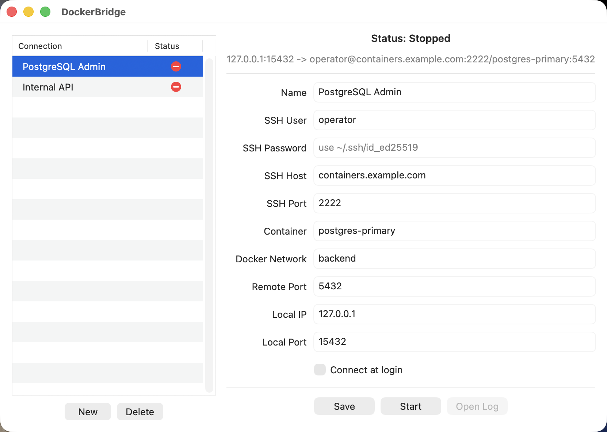
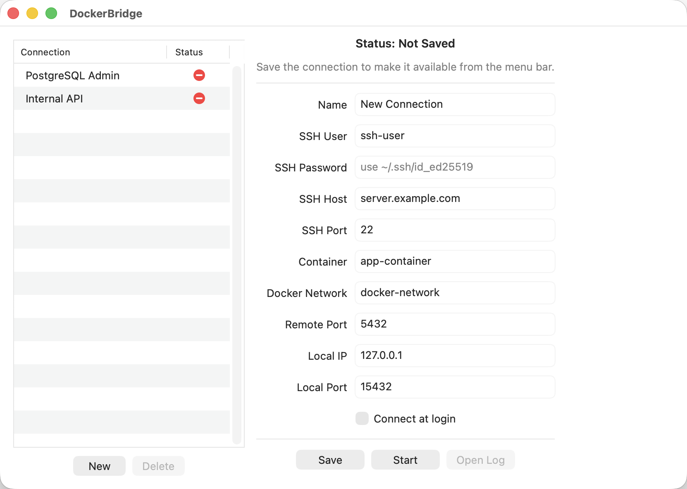
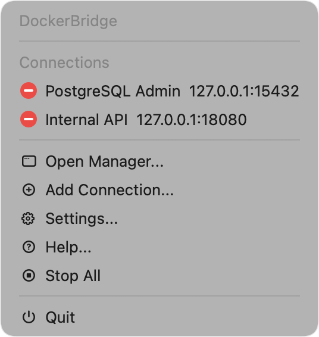
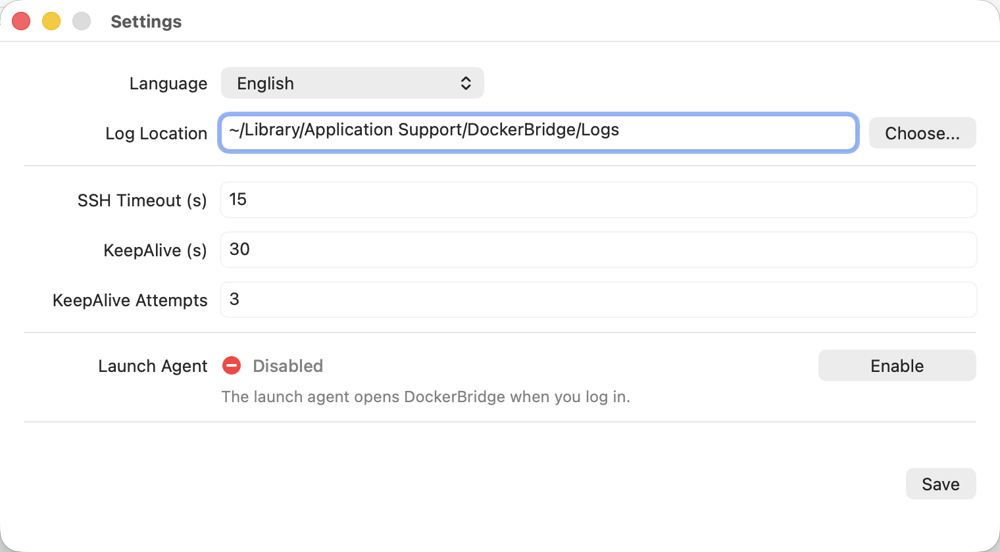
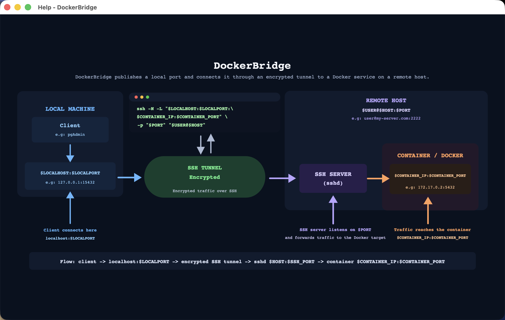

# DockerBridge

DockerBridge is a native macOS menu bar app for managing SSH local port
forwarding tunnels to services running inside Docker containers on remote
hosts.

The SSH transport, remote command execution, and TCP forwarding run in-process
with SwiftNIO and SwiftNIO SSH. DockerBridge does not launch the system `ssh`
client or a shell helper.

## Disclaimer and Trademark Notice

Despite its name and Docker-focused workflow, DockerBridge is fundamentally an
SSH tunnel manager. It is intended for people who administer remote containers
and already understand their SSH access, Docker networks, exposed services,
firewall rules, and the security implications of forwarding remote traffic to
local ports.

DockerBridge is an independent project and is not affiliated with, sponsored
by, or endorsed by Docker, Inc. Docker and the Docker logo are trademarks or
registered trademarks of Docker, Inc. in the United States and/or other
countries.

## Overview


## Screenshots

All connections, hosts, users, and endpoints shown below are fictitious.

### Connection Manager



### New Connection



### Menu Bar



### Settings



### Help



## How It Works

1. DockerBridge connects to the configured SSH host and verifies its host key.
2. It authenticates with a Keychain password or an unencrypted ED25519 private
   key from `~/.ssh/id_ed25519`.
3. It runs `docker container inspect` remotely and reads the container address
   from the selected Docker network.
4. It binds the configured local IP and port.
5. Each local client is forwarded through an SSH `direct-tcpip` channel to the
   container IP and service port.

The first connection to an SSH host displays its SHA-256 fingerprint for
confirmation. A changed host key always requires explicit approval.

## Requirements

- macOS 13 or later.
- SSH access to the remote host.
- Permission to run `docker container inspect` on the remote host.
- Password authentication or an unencrypted OpenSSH ED25519 key at
  `~/.ssh/id_ed25519`.
- Swift 6.1 or later to build from source.

Encrypted private keys and other private-key formats are not supported yet.

## Run From Source

```bash
cd docker-bridge
./Scripts/run.sh
```

The app appears in the macOS menu bar. From the menu you can start or stop
saved connections, open the connection manager, add connections, open
settings, and view the help diagram.

Swift Package Manager downloads the pinned dependencies on the first build.

## Saved Data

Connection profiles are stored in:

```text
~/Library/Application Support/DockerBridge/connections.json
```

Settings are stored in:

```text
~/Library/Application Support/DockerBridge/settings.json
```

By default, connection logs are written to:

```text
~/Library/Application Support/DockerBridge/Logs/
```

Each profile stores the SSH user, host and port, Docker container and network,
remote service port, local IP and port, and automatic-start preference.
Passwords are stored in the macOS Keychain and are never written to the profile
or log files.

The log location, SSH connection timeout, KeepAlive interval, allowed
KeepAlive failures, and UI language can be changed from `Settings...`.

## Localization

DockerBridge supports English, Spanish, and Portuguese. English is the base and
fallback language, while the default setting follows the macOS language. It can
be changed from `Settings...`.

Application strings live in `Resources/en.lproj/Localizable.strings` and
the corresponding `es.lproj` and `pt.lproj` files. The help diagram is localized
as `overview.svg` inside each `.lproj` directory.

## Build

```bash
cd docker-bridge
./Scripts/build.sh
```

The generated app bundle is:

```text
build/DockerBridge.app
```

## Package DMG

```bash
cd docker-bridge
./Scripts/package-dmg.sh
```

The installer image is:

```text
build/DockerBridge.dmg
```

## Website

The static product website lives in `Website/` and is published at
[tecnologica.ar/docker-bridge](https://tecnologica.ar/docker-bridge/). It
includes the localized product page, screenshots, DMG download, and privacy
policy used for App Store Connect.

Run it locally with:

```bash
python3 -m http.server 8765 --directory Website
```

The distributable DMG is copied to `Website/downloads/DockerBridge.dmg` for
deployment but remains excluded from Git because GitHub Releases is the source
of versioned binaries.

## Launch at Login

DockerBridge can enable or disable its login item from the Settings window.
The helper is embedded in the signed application bundle and registered with
Apple's ServiceManagement framework. DockerBridge does not invoke `launchctl`
or install property lists in the user's `Library/LaunchAgents` directory.

## Dependencies

Runtime networking and cryptography are provided by Apple open-source Swift
packages pinned in `Package.resolved`: SwiftNIO, SwiftNIO SSH, and Swift Crypto,
plus their transitive Swift packages.

See [THIRD_PARTY_NOTICES.md](THIRD_PARTY_NOTICES.md) for dependency versions,
licenses, and notices.

## License

DockerBridge is released under the [MIT License](LICENSE).
