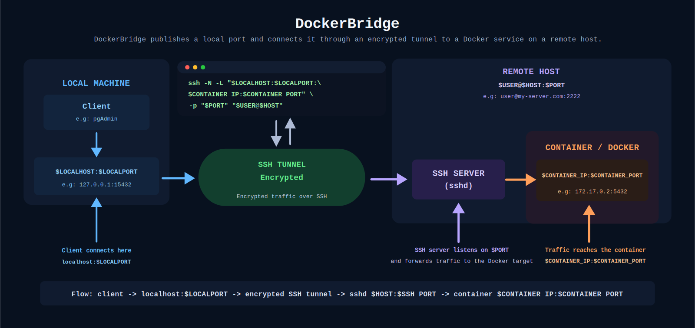

# DockerBridge

DockerBridge is a native macOS menu bar app for managing SSH local port
forwarding tunnels to services running inside Docker containers on remote
hosts.

It bundles a default `connect.sh` helper, keeps saved connections in the user's
Application Support folder, stores SSH passwords in Keychain, and can install
itself as a user launch agent so it starts when the user logs in.

## Disclaimer

DockerBridge is only a graphical manager for SSH local port forwarding. It is
intended for people who administer remote containers and already understand
their SSH access, Docker networks, exposed services, firewall rules, and the
security implications of forwarding remote traffic to local ports.

## Overview



## Run From Source

```bash
cd docker-bridge
./Scripts/run.sh
```

The app appears in the macOS menu bar. From the menu you can start or stop
saved connections, open the connection manager, add new connections, open
settings, and view the help diagram.

## Saved Data

Connection profiles are stored in:

```text
~/Library/Application Support/DockerBridge/connections.json
```

Settings are stored in:

```text
~/Library/Application Support/DockerBridge/settings.json
```

By default, connection logs are written to:

```text
~/Library/Application Support/DockerBridge/Logs/
```

Each profile stores the SSH user, host, SSH port, Docker container, Docker
network, remote port, local IP, and local port. The log location, `connect.sh`
path, SSH timeouts, and UI language can be changed from `Settings...`.

If no custom `connect.sh` path is configured, DockerBridge uses the helper
included in the application bundle. If the SSH password field is left empty,
the connection expects SSH keys or certificates to be already configured.

## Localization

DockerBridge supports English and Spanish:

- English is the base and fallback language.
- The default language setting is `System Default`.
- The language can be changed from `Settings...`.
- App strings live in `Resources/en.lproj/Localizable.strings` and
  `Resources/es.lproj/Localizable.strings`.
- The help diagram is localized as `overview.svg` inside each `.lproj`
  directory.

## Build

```bash
cd docker-bridge
./Scripts/build.sh
```

The generated app bundle is:

```text
build/DockerBridge.app
```

## Package DMG

```bash
cd docker-bridge
./Scripts/package-dmg.sh
```

The installer image is:

```text
build/DockerBridge.dmg
```

## Launch Agent

DockerBridge can install a user launch agent from the Settings window. The
script helpers are still available for development:

```bash
cd docker-bridge
./Scripts/install-login-agent.sh
```

```bash
cd docker-bridge
./Scripts/uninstall-login-agent.sh
```

## License

DockerBridge is released under the [MIT License](LICENSE).
